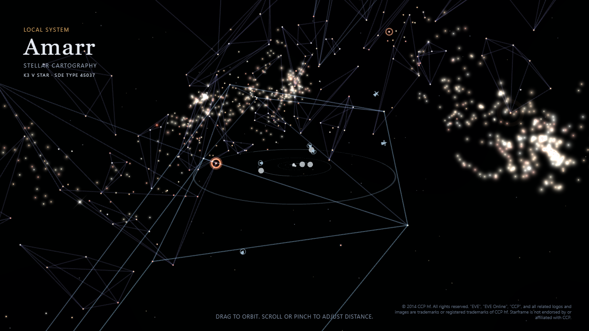

# Starframe

Starframe is an experimental, interactive map of New Eden. It combines an
EVE Online solar-system view with a camera-centred celestial map, real SDE
positions, orbital geometry, stargate travel, constellation glyphs, and
deterministic ambient activity.

[Open the live demo](https://mygodishe.github.io/starframe/)



## Requirements

- Node.js 24
- npm 11
- A browser with WebGL enabled

## Development

```sh
npm ci
npm run dev
```

The development server prints its local URL. The application loads the
generated universe dataset from `public/data/`.

## Checks

```sh
npm run lint
npm run typecheck
npm test
npm run build
npm run test:e2e
```

`test:e2e` builds the production application and runs the Playwright suite in
desktop and mobile Chromium profiles. Install the browser once with
`npx playwright install chromium` if it is not already available.

## Static Data Export

The checked-in dataset was generated from the official EVE Online JSON Lines
Static Data Export. Its build, source URL, and format are recorded in
`sde.config.json`.

To regenerate it after downloading and extracting an SDE archive:

```sh
npm run generate:sde -- \
  --input path/to/extracted-sde \
  --build 3503375 \
  --generated-at 2026-09-10T11:09:04Z \
  --source https://developers.eveonline.com/static-data/tranquility/eve-online-static-data-3503375-jsonl.zip
```

The generator writes per-system resources to `public/data/systems/` and the
universe index to both `public/data/universe-index.json` and
`src/data/universe-index.json`. The source copy is used by integration tests.

## Project Status

Starframe is an experimental visualisation, not a tactical tool. Interfaces,
rendering details, and generated data may change between commits.

## Contributing

See [CONTRIBUTING.md](CONTRIBUTING.md) for the development workflow and
[SECURITY.md](SECURITY.md) for responsible vulnerability reporting.

## License and EVE Online Data

Starframe's source code is available under the [MIT License](LICENSE).
EVE Online game data and CCP intellectual property are not covered by that
license. See [NOTICE.md](NOTICE.md) for data provenance, the required CCP
notice, and the applicable EVE Online Developer License Agreement.
