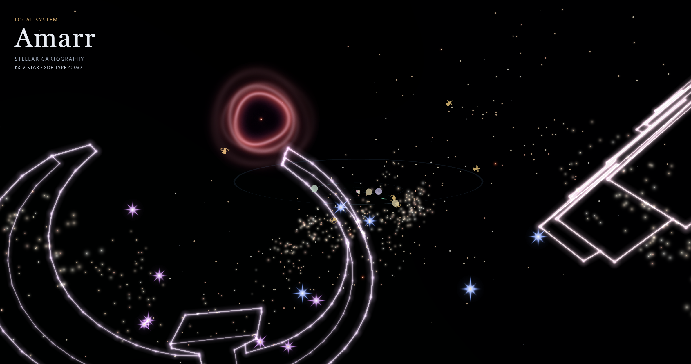

# Starframe

Starframe is an experimental, interactive map of New Eden. It combines an
EVE Online solar-system view with a camera-centred celestial map, real SDE
positions, orbital geometry, stargate travel, constellation glyphs, and
deterministic ambient activity.

[Open the live demo](https://mygodishe.github.io/starframe/)



## Requirements

- Node.js 24
- npm 11
- A browser with WebGL enabled

## Development

```sh
npm ci
npm run dev
```

The development server prints its local URL. The application loads the
generated universe dataset from `public/data/`.

`/sigil.html` is a second page: one Sigil Figure on its own, which you turn by
walking the observer round it. It is where a figure's body is judged, because the
only question that matters for a body is whether it reads from every side. It opens
on the bolt and also holds the atom, the ring, the hammer, the wedge of cheese, the
gear and the diamond - the seven figures this repository generates for itself - and
any figure imported into the library appears beside them.

## Sigil Figures

A Constellation Glyph wears a Sigil Figure, and a figure needs a body with a real
far side for the glyph to hide. Every figure is therefore a sculpted model. Building
bodies out of flat line art was tried first and dropped: a drawing has to be given
depth by rule, and every such rule is a guess about a shape nobody drew.

A fresh clone has seven figures, and every Constellation wears one of them. All
seven are generated, because each is a subject a rule describes exactly rather than
approximately. The ring in `src/constellations/sigilRing.ts` is two radii and two
counts. The atom in `src/constellations/sigilAtom.ts` is a core and two shells built
out of that same tube, set square to each other so they cross at the widest angle
they can from whatever side an observer stands on, with its anchors where an
electron would be. The bolt in `src/constellations/sigilBolt.ts` is two wedges meeting
along a crossbar, each running from a point out to its elbow, with the corner at
each elbow worked out as the mitre between them. Its section is a diamond, so a
ridge runs the length of the stroke front and back: face on it is the outline with a
crease down the middle, and from any one side the near ridge is drawn while the far
one is covered by the body's own thickness. The zigzag lies flat in the plane of its
own silhouette and both ridges stand off it equally, so the body is exactly its own
mirror image in that plane - down to which way each patch of its surface is
triangulated, which its tests check. The hammer in
`src/constellations/sigilHammer.ts` is a block lofted along the axis it strikes on -
straight through the middle, flared to a rim near each end and then chamfered back
into the striking face - with a square grip run down the upright out of the middle of
it. The two are separate closed bodies, because the grip is driven into the head
rather than welded to it, and the head covers the stretch inside it from every side.
The cheese in `src/constellations/sigilCheese.ts` is an eighth of a turn of a slice,
a slab the same thickness all over, lying on one broad, unbroken face. Each side
of it is a lattice in the slice's own coordinates - rings out from the apex by columns
across the spread on the two faces, rings by thickness on the two cuts - and a hole
takes a rectangular block of its cells: a block of m by n cells has 2(m + n) points
round it, and the hole is cut as a ring of exactly that many equal angular sectors, so the lattice
and the hole join point for point and nothing is triangulated against a circle. The
two radial cuts carries three holes of different sizes. Their positions differ between
the cuts rather than forming mirrored pairs. Each closes on a shallow cone under the
surface, which is what a cut through a bubble really shows, while the broad top and
bottom remain solid. The holes are the reason it is in the library: an observer sees
their lips and shallow walls appear as they travel around the slice. The gear in
`src/constellations/sigilGear.ts` is a count of teeth and a handful of radii: a plate
bored through its middle, with a tooth written about its own centre and repeated round
the pitch an exact number of times, so the teeth are equal by construction rather than
by arithmetic that could drift round the last of them. Eight square-shouldered teeth
is what somebody draws when they draw a gear; thirty, at the size a Constellation
Glyph is seen at, is a circle with a rough edge. The diamond in
`src/constellations/sigilDiamond.ts` is a round brilliant, which was a specification
before it was ever a shape: a table, eight bezels, eight star facets and sixteen upper
girdle halves above the girdle, eight pavilion mains and sixteen lower halves below
it, at the proportions a cutter holds to. Only the lengths are typed in. Every facet
of a cut stone is flat, so the corners where neighbouring facets meet - the star tips,
and the junctions under the girdle - are read off the planes of those facets rather
than guessed, which is the difference between a stone and a cone with lines on it. It
is the one convex body in the library: it never shows its own far side through itself,
and what changes as a pilot travels is which of its creases face them.
So none of them costs anybody's work. Every other subject needs a model, and **no
imported model is committed to this repository** - a model is somebody else's sculpture, and whether
it may be redistributed is their decision rather than a star map's. Importing one is
therefore a step each build takes for itself, over a model it has the right to use:

```sh
npx tsx scripts/import-sigil-model.ts path/to/model.stl --name=wolf
```

The importer cuts off a print's display plinth if asked (`--floor`), reduces the
mesh to a triangle budget the facing test can run every frame (`--faces`), marks
the creases sharp enough to be part of the drawing (`--crease`), and marks the
extremities a real Solar System is meant to land on (`--anchors`). It writes
`src/data/sigil-models/<name>.json` and refuses to write a surface that is not
closed. Add that file to the list in `src/constellations/sigilModel.ts` - that list
is the figure library - then check the result on `/sigil.html?figure=<name>`. Which
Constellation wears which figure comes from `src/data/constellation-motifs.json`,
regenerated with `scripts/generate-motifs.ts`.

## Checks

```sh
npm run lint
npm run typecheck
npm test
npm run build
npm run test:e2e
```

`test:e2e` builds the production application and runs the Playwright suite in
desktop and mobile Chromium profiles, several pages at a time. It asserts on the
`data-*` attributes the scene publishes about what it drew rather than on
reference images, so it needs no per-platform snapshots. Install the browser once
with `npx playwright install chromium` if it is not already available.

## Static Data Export

The checked-in dataset was generated from the official EVE Online JSON Lines
Static Data Export. Its build, source URL, and format are recorded in
`sde.config.json`.

To regenerate it after downloading and extracting an SDE archive:

```sh
npm run generate:sde -- \
  --input path/to/extracted-sde \
  --build 3503375 \
  --generated-at 2026-09-10T11:09:04Z \
  --source https://developers.eveonline.com/static-data/tranquility/eve-online-static-data-3503375-jsonl.zip
```

The generator writes per-system resources to `public/data/systems/` and the
universe index to both `public/data/universe-index.json` and
`src/data/universe-index.json`. The source copy is used by integration tests.

## Project Status

Starframe is an experimental visualisation, not a tactical tool. Interfaces,
rendering details, and generated data may change between commits.

## Contributing

See [CONTRIBUTING.md](CONTRIBUTING.md) for the development workflow and
[SECURITY.md](SECURITY.md) for responsible vulnerability reporting.

## License and EVE Online Data

Starframe's source code is available under the [MIT License](LICENSE).
EVE Online game data and CCP intellectual property are not covered by that
license. See [NOTICE.md](NOTICE.md) for data provenance, the required CCP
notice, and the applicable EVE Online Developer License Agreement.
